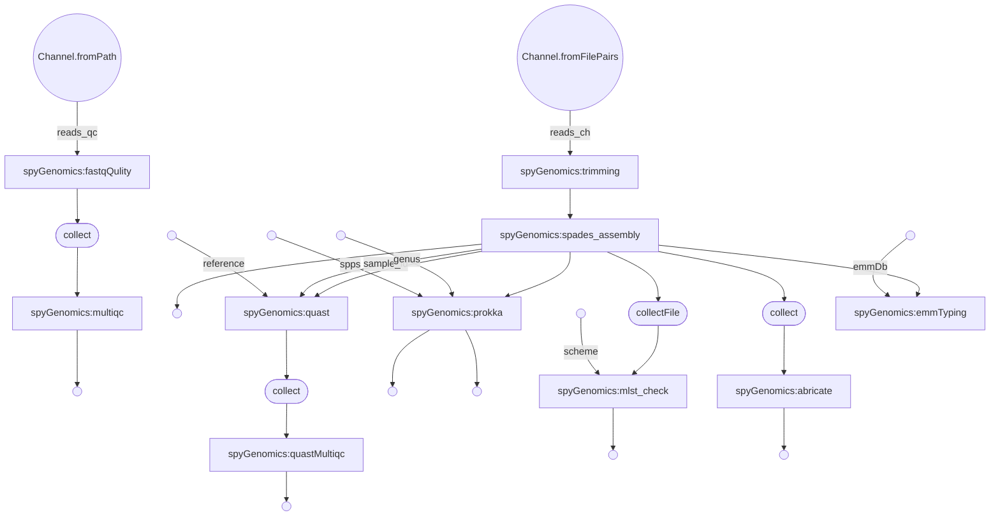

# Streptococcus genomics workflow

This workflow is for the analysis for Streptococcus from genome assembly, annotation, mlst and associated analysis.
It is develop using the nextflow pipeline using docker containers that contain all the required software tools.

***
Nextflow workflow
*** 

